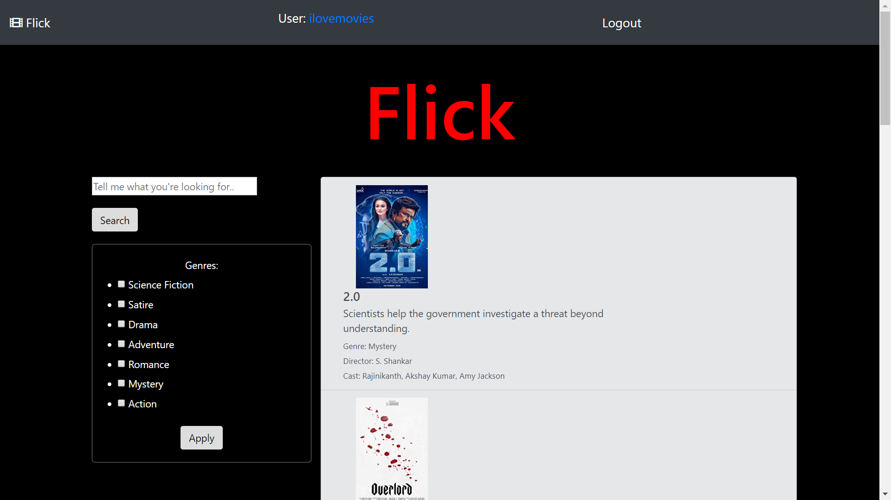
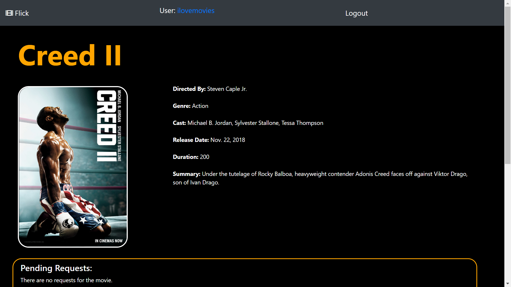
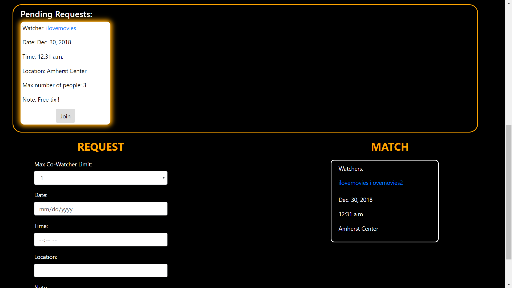
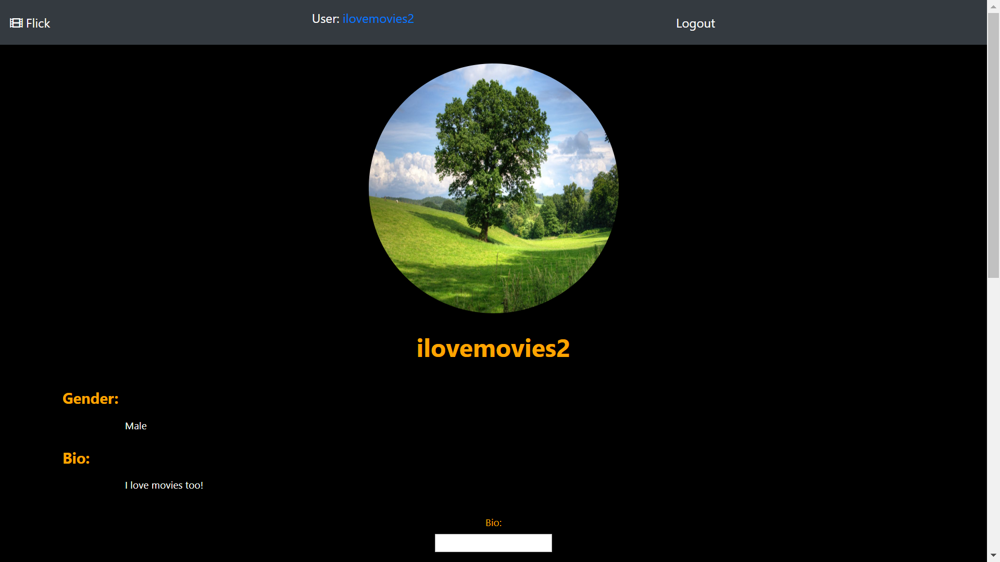
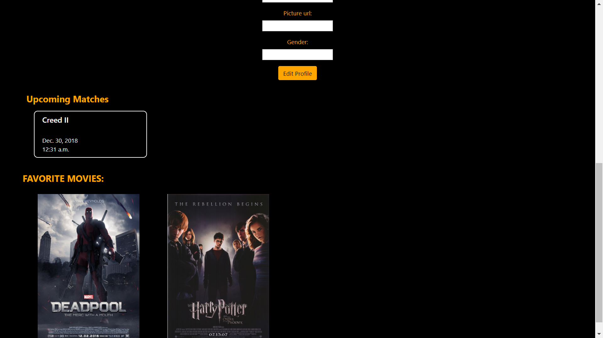
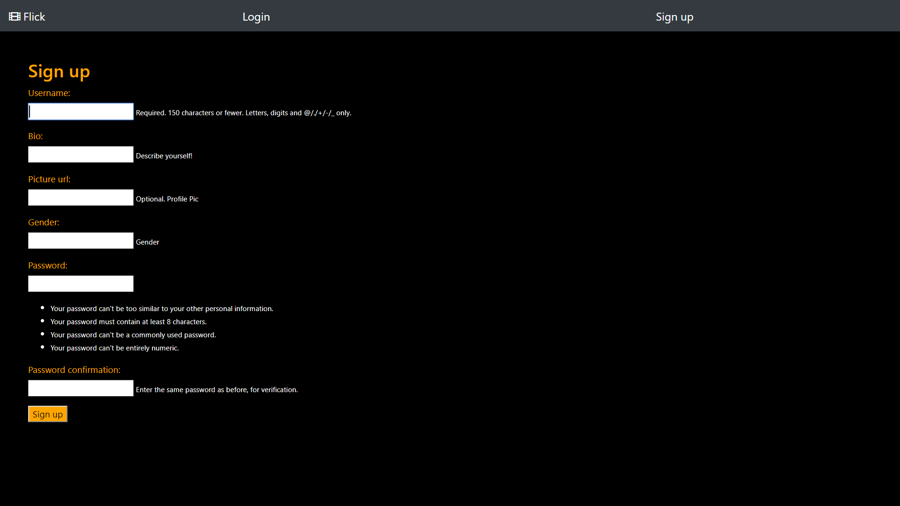
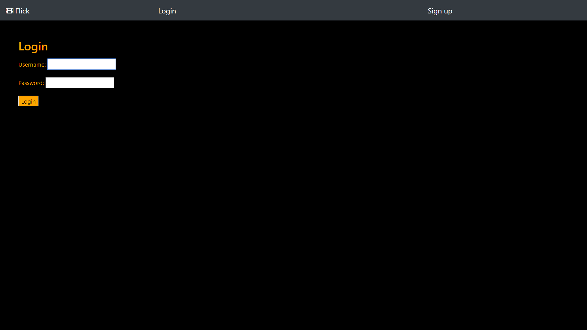
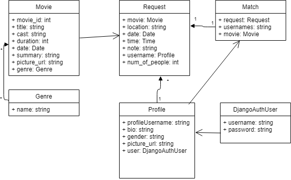

<h2>Team Knock Out </h2>
<h3>Flick - Don’t Watch a Movie Alone Ever Again!</h3>
<h3>Fall 2018</h3>

Overview: Our team is creating an application where an individual can schedule a time, request a party of up to 5 people, and match with those people to watch a movie of their choice. It is called “Flick”. This application is unique in its own way as there are no technologies available in society today for a match movie system for people. The whole idea of this application is so that no one has to watch a movie alone if they don’t want to, and can use this application to make friends around the UMass or Five College campuses. This application consists of 5 web pages, a homepage where all the movies are listed, a page where an individual can request to watch a specific movie at a certain time of their choice, and a location of their preference with people they want to watch it with. 

<strong>Team Members</strong>: A list of your team members
Apoorva Karpurapu
Kuhu Wadhwa
Damin Zhang
Long To
Frick Shao
Kurtis Chau

<h3>User Interface: </h3>

Index/Home page: displays a list of current movies, allow user to search for a particular movie, as well as to filter movie based on genre.

Movie page: Displays details about a specific movie, any pending requests (if any) for the movie, and all the matches for that movie.  This page also allows user to submit a request, as well as to join a request (matching). 

Profile page:  This page is essentially a user page, it displays the basic info (bio, profile pic, gender etc), upcoming movie dates for that user.  This page also allows a user to edit their profile (if page that is being viewed belongs to the logged in user).

Sign up page: allow user to sign up for a profile account.

Log in page: allows user to log in.

<h3>Data Model:</h3>

Movie contains all basic information of a movie: cast, summary etc.  Genre represents a genre, there is multiple genres, and a movie can be in multiple genres.  Request is a user’s request to watch a movie, it contains all necessary information of a request as well as the Profile (user) who initialized the request.  Match is a class that represents a request that has been join, so it would have usernames, which is a list of user names (we are doing this instead of implementing multiple user relationship in Request, so that it is easier to query).  Match also belongs to a movie (this is inferred from Request).  Profile is the acutally app user, a profile would have a profileUsername, bio, gender, picture_url, and user.  Not that DjangoAuthUser is the default Django user to handle authentication/Authorization.  So the Profile class is basically a wrapper of DjangoAuthUser.  So in this document Profile and User mean the same thing, they are used interchangeably.

<h3>URL Routes/Mappings:</h3>

/index - app homepage: list of current movies, allows user to filter/search

/index/movie/<movie_id>: movie detail page.  Also handles main functionality of the app: request and matching

/index/user/<username>: user profile page.  Also allows user to edit profile information and displays upcoming matches
  
/index/signup: sign up page, allows user to create account

/index/login: login page

/index/logout: logout page and redirect

<h3>Authentication/Authorization:</h3>

Users are authenticated using Django default authentication mechanism.  User first signs up using the signup page.  This would create a Django user account as well as a Flick app user profile.  The authentication as well as other features session, timeout etc. would be handled by Django.  Each user account is associated with a app profile, the editing permission of the profile is also handled by Django.  
<h3>Team Choice: </h3>

Our team choice was to implement a filter on the index page to better allow users access to a specific movie they want to watch. It does not require another url route or view, because the filter itself is on our index page and the links map to the movie page where users can make requests and find matches.

<h3>Conclusion: </h3>

Before starting the project, the team has insufficient knowledge about what kind of skills each member has, which causes a bit trouble assigning tasks. Moreover, everyone has different schedules, and that makes it hard to have every team members join the meeting together. However, the team does learn from the difficulties encountered, each member does his/her best to fit the meeting into their schedule and learn as much web programming as possible. 

